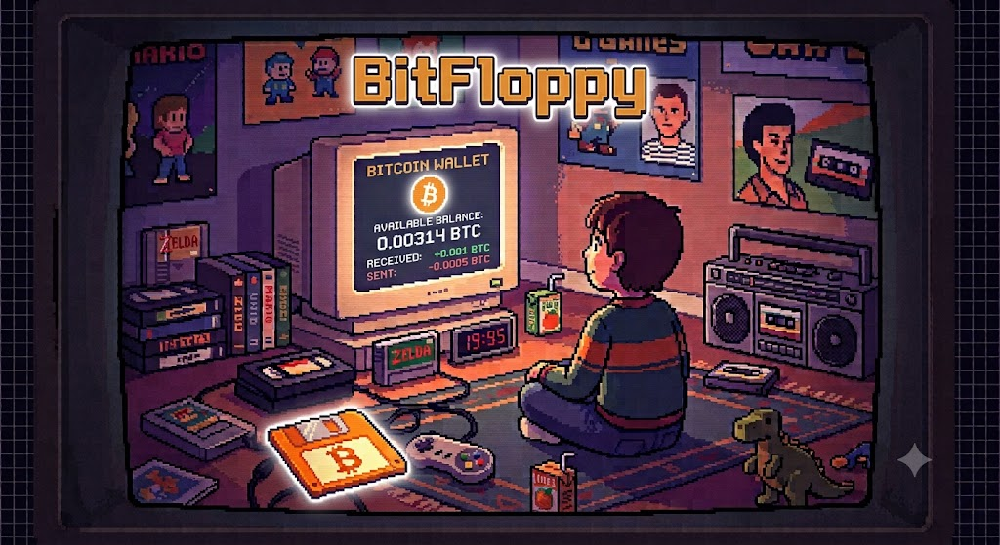

<section class="hero">
  

    
// BITCOIN HARDWARE WALLET

    <h1>Wallet on a floppy.</h1>
    
An offline Bitcoin signer with a simple file-based workflow. Move PSBT files by USB and keep signing keys off the network.

    
SYSTEM STATUS: READY_

    

      <a class="pixel-button" href="flashing.html">FLASH FIRMWARE</a>
      <a class="pixel-button alt" href="sparrow.html">USE WITH SPARROW</a>
    

  

  

    <figure class="floppy-photo">
      
      <figcaption>BITFLOPPY // OFFLINE BY DESIGN</figcaption>
    </figure>
  

</section>

<section>
  
// QUICK START

  

    <article class="panel">
      <h3>01. Flash it</h3>
      
Install BitFloppy on a supported Lolin S2 Mini.

      
<a href="flashing.html">Open flashing guide →</a>

    </article>
    <article class="panel">
      <h3>02. Connect it</h3>
      
Use the board as a small, familiar USB storage drive.

      
<a href="user-guide.html">Read the user guide →</a>

    </article>
    <article class="panel">
      <h3>03. Sign offline</h3>
      
Copy a PSBT to the drive and retrieve the signed result.

      
<a href="sparrow.html">Set up Sparrow →</a>

    </article>
  

</section>
