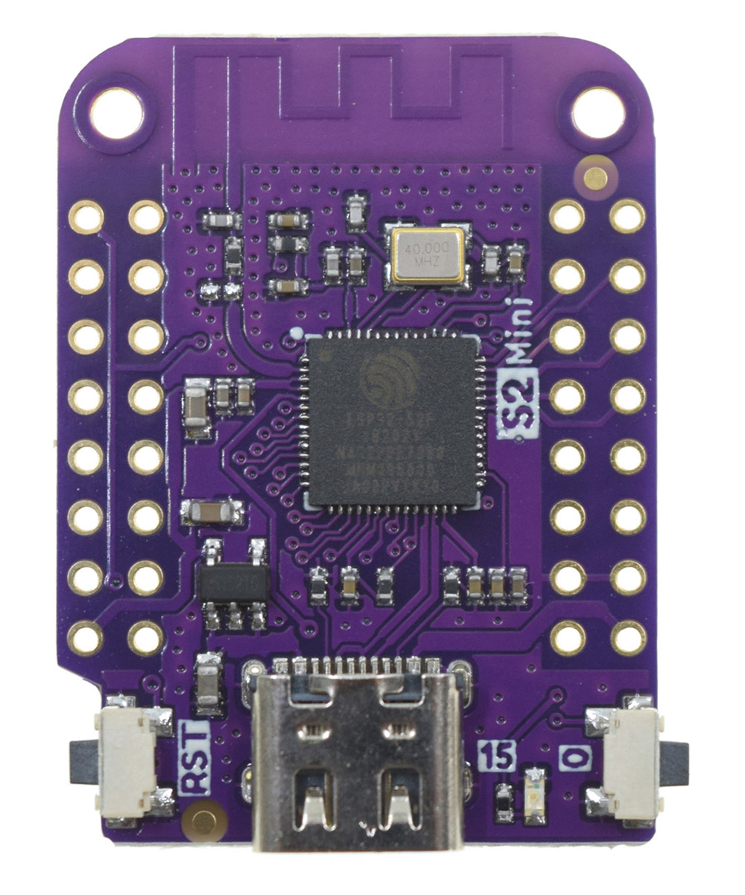

# User guide

BitFloppy updates its status every time the board restarts. When it is ready, it exposes a 1.44 MB mass-storage drive containing Bitcoin wallet files.

> **Security notice:** BitFloppy is a proof of concept. Use testnet or signet only—never real funds.

## Board status

- `UNKNOWN` — a new board; it becomes `EMPTY`.
- `EMPTY` — no secret material; a secret is generated and the state becomes `LOCKED`.
- `LOCKED` — public wallet files are available.
- `UNLOCKED` — wallet files, including secrets, are available.
- `CUSTOM_EMPTY`, `CUSTOM_LOCKED`, `CUSTOM_UNLOCKED` — equivalents for user-provided seed material.
- `FORMAT` — removes existing data, then returns to `EMPTY` or `CUSTOM_EMPTY`.

## Files on the drive

The device can create `network.txt`, `log.txt`, and `README.txt`. In its unlocked state, it can also show `mnemonic.txt` and `passphrase.txt`.

The `bip44`, `bip49`, and `bip84` folders contain derived addresses, change addresses, extended public keys, and—only while unlocked—private key material.

## Initialize

Initialization is automatic. After the initial file generation, the board appears as mass storage. Files are regenerated on every reboot, so deleted generated files return after restarting the device.

## Unlock private material

1. Create a file called `UNLOCK.txt` on the BitFloppy drive.
2. Unmount or safely eject the drive.
3. Restart the board.

The regenerated files now include the mnemonic, passphrase, and private-key data. Treat this state as sensitive.

## Sign a PSBT

1. Create `PSBT.txt` containing the base64 PSBT.
2. Unmount or safely eject the drive.
3. Restart the board.
4. Retrieve the generated `PSBT_signed.txt`.

Signing unlocks the board, so handle the device and generated files carefully. For wallet setup, see [Sparrow integration](sparrow.html).

## Reset or use a custom seed

1. Create `FORMAT.txt`.
2. Optionally add `MNEMONIC.txt` and `PASSPHRASE.txt`.
3. Optionally add `NEWTWORK.txt` to select testnet; omit it to use the default network.
4. Unmount or safely eject the drive, then restart.

The board removes its previous information and generates or imports the new secret material.

## Supported hardware

### Lolin S2 Mini ESP32-S2

Supported board: Lolin S2 Mini. Follow the [firmware flashing guide](flashing.html) to prepare it.
