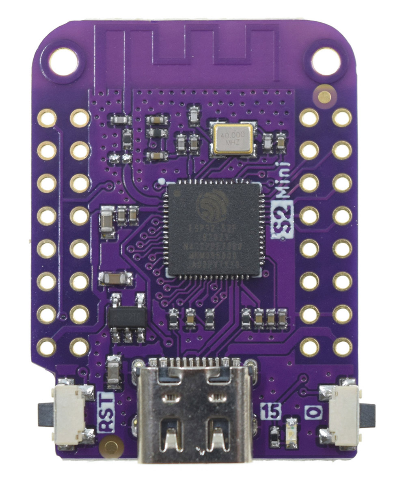

# BitFloppy Documentation Hub

> A Bitcoin hardware wallet disguised as a 1.44 MB floppy disk

Welcome to the complete BitFloppy documentation! This is your central hub for all information about using, flashing, and developing with BitFloppy.

## 🚀 Quick Start

1. **[Flash Firmware](flashing.md)** - Get your board ready
2. **[Download Firmware](binaries/)** - Get pre-built firmware
3. **[User Guide](#user-guide)** - Learn how to use BitFloppy
4. **[Sparrow Integration](sparrow.md)** - Use with Sparrow Wallet

## 📚 Complete Documentation

### Getting Started
- **[Firmware Flashing](flashing.md)** - Complete guide to flashing firmware
- **[Firmware Binaries](binaries/)** - Download pre-built firmware
- **[Sparrow Wallet Integration](sparrow.md)** - Use with Sparrow Wallet

### Advanced Usage
- **[Command-Line Tools](../flash_board.py)** - Python flashing script
- **[Shell Scripts](../flash_board.sh)** - Shell script wrapper
- **[PlatformIO Integration](../flash_pio.py)** - Build from source

### Development
- **[Main Project](../README.md)** - Project overview and development
- **[Source Code](../src/)** - C++ source code
- **[PlatformIO Config](../platformio.ini)** - Build configuration

## 📋 Quick Navigation

- **[💾 Firmware Binaries](binaries/)** - Download pre-built firmware
- **[🔧 Firmware Flashing](flashing.md)** - How to flash firmware to your board
- **[🕊️ Sparrow Wallet Integration](sparrow.md)** - Use with Sparrow Wallet
- **[🏠 Main Project](../README.md)** - Project overview and development information

# User Guide

## 🎯 How It Works

Every time you restart the board, the software updates its status and performs needed actions. When complete, the board shows a 1.44 MB Mass Storage interface with various Bitcoin wallet files.

# Status

A board can be in one of the following status: 
- UNKNOWN, board is new and never used, the firmware will set the status to EMPTY,
- EMPTY, board don't have secret material, secret material will be generated and status change to LOCKED,
- LOCKED, board derive all files and wait,
- UNLOCKED, board derive all files including secrets and wait,
- CUSTOM_EMPTY, board don't have secret material, secret material will be generated using provided files and status change to CUSTOM_LOCKED,
- CUSTOM_LOCKED, board derive all files and wait,
- CUSTOM_UNLOCKED,  board derive all files including secrets and wait,
- FORMAT, board will delete files and secret and move to EMPTY or CUSTOM_EMPTY.

# Generated files

The memory of the board can contains the following files:
- mnemonic.txt, the menmonic used (this file is present only in unlocked status),
- network.txt, the network used,
- passphrase.txt, the passphrase used (this file is present only in unlocked status),
- log.txt, complete log of all action perfomed,
- README.txt, brief explanation similar to this file.

Plus 3 directories, bip44, bip49 and bip 84 with the following files:
- addresses.txt, list of derived addresses with derivation 0/*,
- changes.txt, list of derived adddresses with derivation 1/*,
- xpub.txt, extended public key,
- xpriv.txt extended private key (or some *** if locked).

# Actions

## Initialization

You don't need to do anything, initialization is automatic and at the end of files generation you will see a Mass Strorage with all your files.

Files are generated EVERY time you turn on the board so don't worry if you deleted or modified it, after a reboot you will have back all your files!

## Unlock

If you want to shows mnemonic, passphrase, xpriv keys and address private keys you just need to:

- write a file with name `UNLOCK.txt`,
- unmount the volume,
- restart the board.

The board will generate new files (e.g. the file with menmonic) and shows keys close to addresses.

## Sign PSBT"

If you want to sign a PSBT you just need to:

- write the PSBT (in base64) in a file with name `PSBT.txt`,
- unmount the volume,
- restart the board.

The board will generate new files `PSBT_signed.txt` with the signed PSBT.

This action will UNLOCK the board!

## Format

If you want change the mnemonic you have to:

- write a file with name `FORMAT.txt`,
- write a file with name `MNEMONIC.txt` if you want a custom mnemonic or remove it if you dont want,
- write a file with name `PASSPHRASE.txt` if you want a custom passphrase or remove it if you dont want,
- write a file with name `NEWTWORK.txt` if you want a custom network or remove it if you want use testnet,
- unmount the volume,
- restart the board.

The board will remove all previouse informations generate or load secrets.

# Supported Hardware

## Lolin S2 Mini ESP32-S2 Board

*Note: Replace placeholder with actual board image*

**Supported boards:**
- Lolin S2 mini

## 📚 Complete Documentation

### Getting Started
- **[Firmware Flashing](flashing.md)** - Complete guide to flashing firmware
- **[Firmware Binaries](binaries/)** - Download pre-built firmware
- **[Sparrow Wallet Integration](sparrow.md)** - Use with Sparrow Wallet

### Advanced Usage
- **[Command-Line Tools](../flash_board.py)** - Python flashing script
- **[Shell Scripts](../flash_board.sh)** - Shell script wrapper
- **[PlatformIO Integration](../flash_pio.py)** - Build from source

### Development
- **[Main Project](../README.md)** - Project overview and development
- **[Source Code](../src/)** - C++ source code
- **[PlatformIO Config](../platformio.ini)** - Build configuration

## ⚠️ Security Notice

**This project is a Proof-of-Concept. Use only with testnet or signet funds!**

**Are my funds safe? NO, PLEASE DON'T USE WITH REAL FUNDS.**
